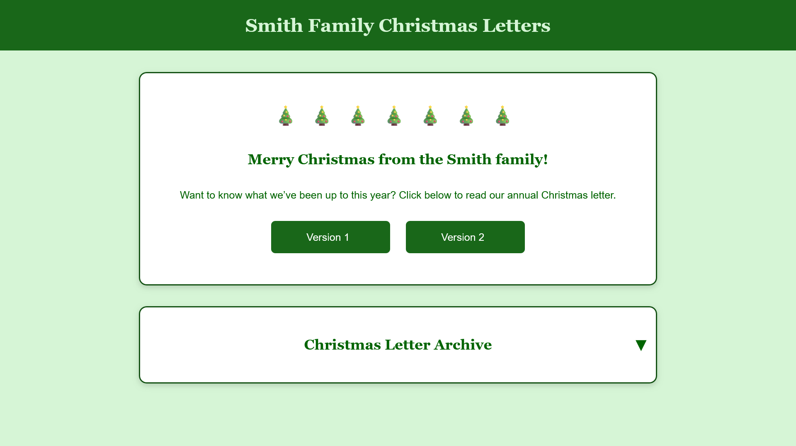
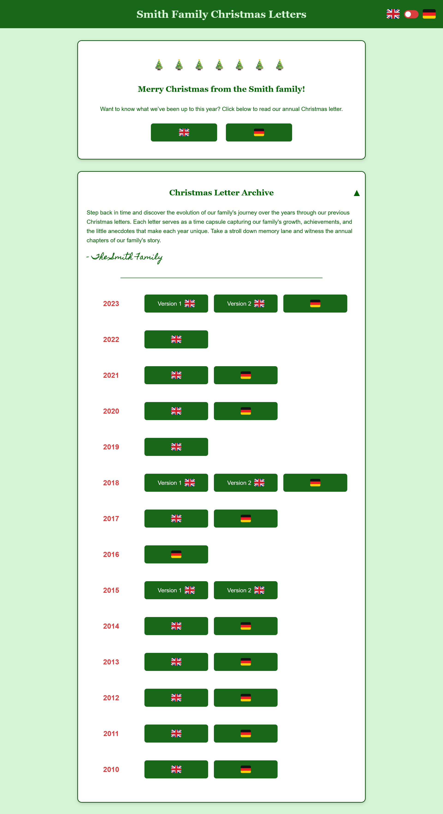

# Family Christmas Letter Website

This project provides the code and instructions to create a simple bilingual website for sharing private family Christmas letters with password protection and easy deployment. 

## Table of Contents

- [Features](#features)
- [Project Structure](#project-structure)
- [Screenshots](#screenshots)
- [Login and Authentication](#login-and-authentication)
- [Configuration](#configuration)
    - [Christmas Letters](#christmas-letters)
    - [Localization](#localization)
- [Deployment](#deployment)
- [Live Demo](#live-demo)
- [License](#license)


## Features

- **Bilingual Support**: Built-in language toggle, translation logic, and localization configurations. 
- **Responsive Design**: Mobile-friendly layout.
- **Login & Authentication**: Middleware authentication to restrict access with a password.
- **Free Website Hosting**: Hosted as a Cloudflare Pages site.
- **Simple Deployment**: Fork, configure, and deploy quickly with Cloudflare/Wrangler.

## Project Structure

```plaintext
├── /configs
│   └── christmas_letters.json
│   └── localization.json
├── /functions
│   └── _middleware.ts         # Middleware for login and authentication
├── /letters                   # Directory containing the Christmas letters as PDF files
├── /screenshots               # Directory containing the project screenshots
├── index.html                 # Main HTML file for the website
├── wrangler.toml              # Cloudflare Pages configuration file
```

## Screenshots

### Login Page  
*Secure login page where users can enter a password to access the family Christmas letters.*

  


---

### Language Toggle  
*Single language website with no language toggle.*

  

*Bilingual website with language toggle in the header.*

  


---

### Archive  
*Organized archive showcasing previous Christmas letters by year and language.*

  

## Login and Authentication

The middleware layer functionality is centered around managing access to the private Christmas letters through a password-based authentication system. Upon a user's initial access, they are prompted to enter a password. The system verifies this password against a pre-configured, securely hashed password stored in the Cloudflare Page project environment variables (configurable in `wrangler.toml`). If the user provides the correct password, the system sets a authentication browser cookie allowing the user access the website without reauthentication for the next 12 hours. If the authentication cookie is missing, invalid or expired, users are redirected to the login page to re-authenticate. 

## Configuration

### Christmas Letters

The `christmas_letters.json` file holds the details for each year's family Christmas letters, including the year, title (optional), language (optional), and the location of the corresponding PDF file. This configuration is essential for organizing and displaying the letters on the website, with the most recent year shown in the main section and previous letters located in the Archive section. 

Here’s a sample of the data from `christmas_letters.json`:


```json
[
  {
    "year": 2024,
    "letters": [
      { "language": "en", "pdfSrc": "letters/2024 - Smith Family Christmas Letter (English).pdf" },
      { "language": "de", "pdfSrc": "letters/2024 - Smith Family Christmas Letter (German).pdf" }
    ]
  },
  {
    "year": 2023,
    "letters": [
      { "title": "Version 1", "language": "en", "pdfSrc": "letters/2023 - Smith Family Christmas Letter (English).pdf" },
      { "title": "Version 2", "language": "en", "pdfSrc": "letters/2023 - Smith Family Christmas Letter (English).pdf" },
      { "language": "de", "pdfSrc": "letters/2023 - Smith Family Christmas Letter (German).pdf" }
    ]
  }
]
``` 

### Localization

The `localization.json` file contains the configuration for the localization settings of the website. It includes a list of enabled languages, translations for various elements of the page, and placeholder variables for dynamic content. This configuration file allows you to easily manage and add new languages, update page content dynamically, and maintain a seamless user experience across multiple languages.

#### Key Fields:

- **enabledLanguages**: A comma-separated list of the enabled languages used to populate the language toggle in the header. If only one language is provided, the website will be monolingual. 

- **placeholders**: A set of dynamic variables that will be replaced in the translated page content (e.g., year, family name). 

- **translations**: An object containing key-value pair translations for each language.

The provided configuration file currently includes support for English, Spanish, French, and German. However, it is easy to extend this configuration to add additional languages by following the existing structure. 

Here’s a sample of the data from `localization.json`:

```json
{
  "enabledLanguages": "en, de",
  "placeholders": {
    "familyName": "Smith"
  },
  "translations": {
    "en": {
      "mainPageTitle": "{{familyName}} Family Christmas Letters",
    },
    "de": {
      "mainPageTitle": "Weihnachtsbriefe der Familie {{familyName}}"
    }
  }
}
```

## Deployment

1. **Fork the Repository**:
   - Click the "Fork" button in GitHub to create your copy of the repository. I highly recommend keeping your forked repository private to insure your Christmas letters and website password remain private.
   
2. **Add Christmas Letters**:
   - Add your Christmas letters in PDF format to the `/letters` directory.

3. **Update Configurations**:
   - Update the `wrangler.toml` file with your desired project name and website password.
   - Update the `christmas_letters.json` file to match the name, language, and location of each Christmas letter. 
   - Update the `localization.json` file with to enable your desired language(s) and update the familyName placeholder (unless of course you family name is actually Smith 😋 ). Optionally, you can also customize the translations as needed or add a new language if your desired language is missing.

4. **Deploy with Cloudflare Pages**:
    -   Create a new Cloudflare Pages project, keeping all the default settings.
    -   Link it to your newly forked repository. Cloudflare and Wrangler will automatically set up the build pipeline for your project and any future changes to your GitHub repo will automatically trigger a build in Cloudflare Pages.
    -   Once the build process is complete, Cloudflare will provide you with a URL for your project (e.g., `https://your-project-name.pages.dev`).

5. **(Optional) Set Up a Custom Domain**:
    -   If you have a custom domain name and want to use it for your Christmas letter website, you can set up a DNS record to point to the new Cloudflare Page. This will allow you to access your site using your custom domain (e.g., `christmasletters.yourdomain.com`)
    -   In your Cloudflare dashboard, go to your domain's DNS settings and add a CNAME or A record that points to the URL Cloudflare provided for your project.

## Live Demo

You can view a live demo of the website, built directly from this repository, at the following link:

 [https://christmas-letters-demo.pages.dev/](https://christmas-letters-demo.pages.dev/). 

To login, use the password: **`demo123`**.

## License

This project is licensed under the GNU GPLv3 License - see the [LICENSE](LICENSE) file for details.
